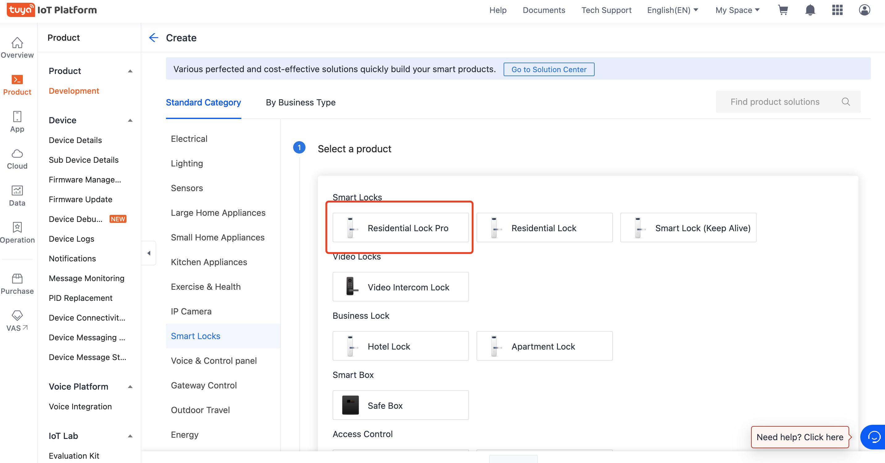

English[](README.md) | [简体中文](README_zh.md)

## Residential Lock Pro Use Cases

- productName: Residential Lock Pro

### Get started：

1. Go to [IoT platform](https://iot.tuya.com/) to create products

2. Select category `Residential Lock Pro  Select Bluetooth Protocol`
   
3. Function selection

   Required Dps

   ```
   remote_no_pd_setkey,
   remote_no_dp_key,
   ```

4. Install project and start project

   ```
   yarn && yarn start
   ```

## :rocket: If you have questions, please visit the following link for a detailed tutorial:

- [About Ray](https://developer.tuya.com/cn/ray)
- [Use `Ray` to develop universal panel](https://developer.tuya.com/cn/miniapp-codelabs/codelabs/panelmore-guide/index.html#0)

## Technical support

You can use [GitHub Issue](https://github.com/Tuya-Community/tuya-ray-demo/issues) to give us feedback on any problems and we are ready to help you out.

## License

For more information, see [MIT License](LICENSE).