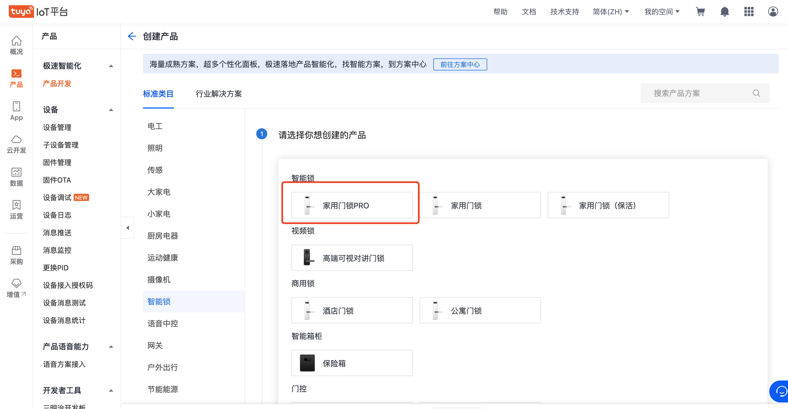

[English](README.md) | 简体中文[](README_zh.md)

## 家用门锁pro案例

- 产品名称 家用门锁pro

### 快速开始：

1. 前往[IoT 平台](https://iot.tuya.com/)创建产品

2. 选择品类 `家用门锁pro 选择蓝牙协议`
   
3. 功能选择

   必须的功能点

   ```
   remote_no_pd_setkey,
   remote_no_dp_key,
   ```

4. 安装项目并启动项目

   ```
   yarn && yarn start
   ```

## :rocket: 若有疑问，请访问以下链接查看详细教程

- [使用 `Ray` 开发万能面板](https://developer.tuya.com/cn/miniapp-codelabs/codelabs/panelmore-guide/index.html#0)
- [关于 Ray](https://developer.tuya.com/cn/ray)

## 如何获得技术支持

欢迎通过 [GitHub Issue](https://github.com/Tuya-Community/tuya-ray-demo/issues) 向我们反馈使用的问题和获得帮助

## 许可

[许可详情](LICENSE)