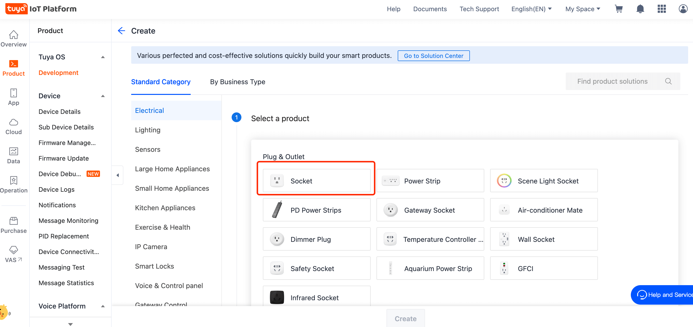

English[](README.md) | [简体中文](README_zh.md)

## Socket Panel Use Cases

- productName: Socket Panel

### Get started：

1. Go to [IoT platform](https://iot.tuya.com/) to create products

2. Select category `Socket`
   
3. Function selection

   Required Dps

   ```
   switch_1,
   countdown_1,
   ```

4. Install project and start project

   ```
   yarn && yarn start
   ```

## Notice

This template requires the product to enable the advanced power statistics capability in order to use the power statistics function normally.
For relevant instructions on the type parameter in the statistical interface, please refer to [here](https://www.tuyaos.com/viewtopic.php?t=973)

## :rocket: If you have questions, please visit the following link for a detailed tutorial:

- [About Ray](https://developer.tuya.com/cn/ray)
- [Use `Ray` to develop universal panel](https://developer.tuya.com/cn/miniapp-codelabs/codelabs/panelmore-guide/index.html#0)

## Technical support

You can use [GitHub Issue](https://github.com/Tuya-Community/tuya-ray-demo/issues) to give us feedback on any problems and we are ready to help you out.

## License

For more information, see [MIT License](LICENSE).
