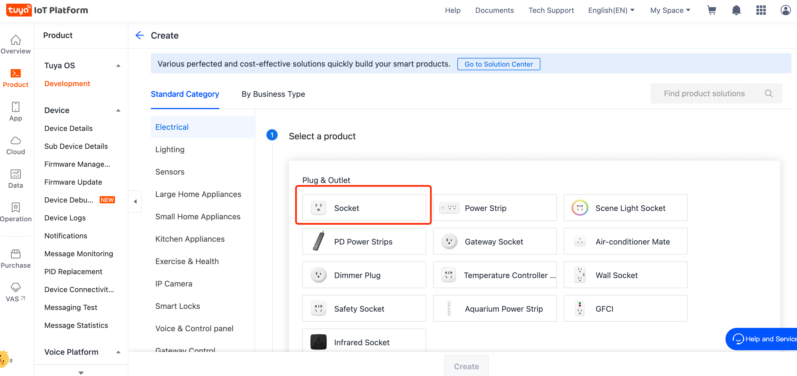
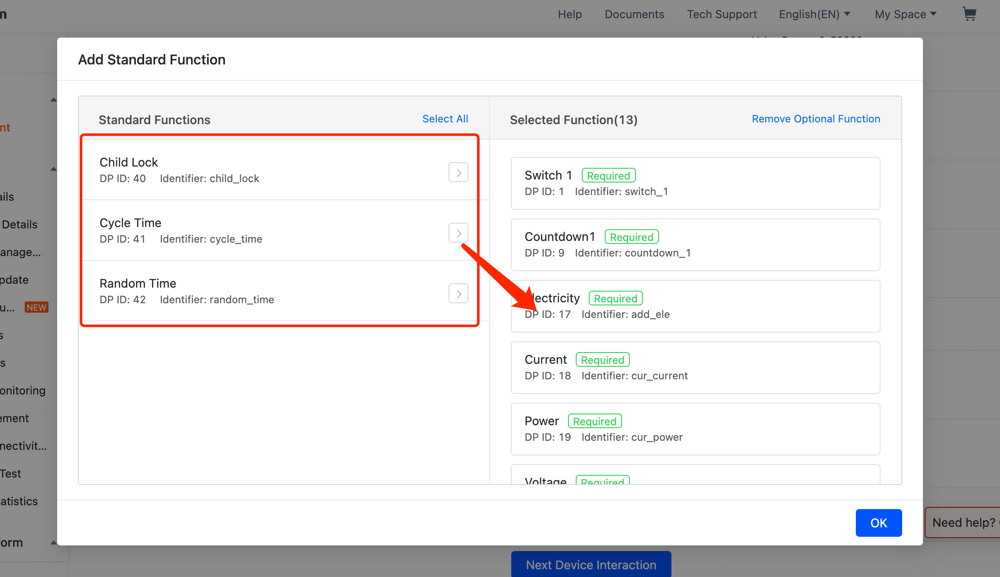

English[](README.md) | [简体中文](README_zh.md)

## Socket Panel Use Cases

- productName: Socket Panel

### Get started：

1. Go to [IoT platform](https://iot.tuya.com/) to create products

2. Select category `Socket`
   
3. Function selection

   In addition to common functions, select the following standard functions`

   

   ```
   cycle_time,
   random_time,
   child_lock
   ```

4. Confirm and record the product 'PID' you created and fill it in the 'project.tuya.json`

   

   ```
   {
     "projectname": "socket panel",
     "i18n": false,
     "description": "project description",
     "miniprogramRoot": "./dist/tuya",
     "dependencies": {
       "BaseKit": "3.0.0",
       "MiniKit": "3.0.2",
       "DeviceKit": "3.0.2",
       "BizKit": "3.0.1"
     },
     "baseversion": "2.10.1",
     "productId": "p0i6xwrgm6uvlaau"
   }
   ```

5. Install project and start project

   ```
   yarn && yarn start
   ```

6. Use the `IDE` to import the project

   Use the `Tuya Smart App` to scan the code to log in
   

   Open the `virtual device` for debugging
   

7. Code scanning real machine debugging

   Use the`Tuya Smart App` to scan the code to debugging with real machine
   
   

## References

For more information, see:

- [About Ray](https://developer.tuya.com/cn/ray)
- [Use `Ray` to develop universal panel】](https://developer.tuya.com/cn/miniapp-codelabs/codelabs/panelmore-guide/index.html#0)

## Technical support

You can use [GitHub Issue](https://github.com/Tuya-Community/tuya-ray-demo/issues) to give us feedback on any problems and we are ready to help you out.

## License

For more information, see [MIT License](LICENSE).
