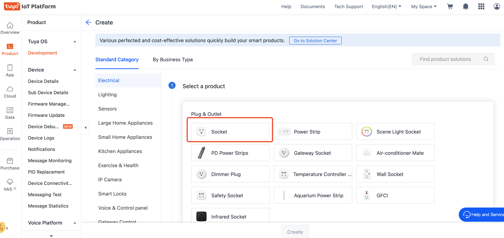
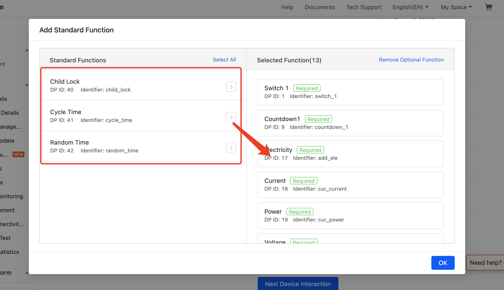
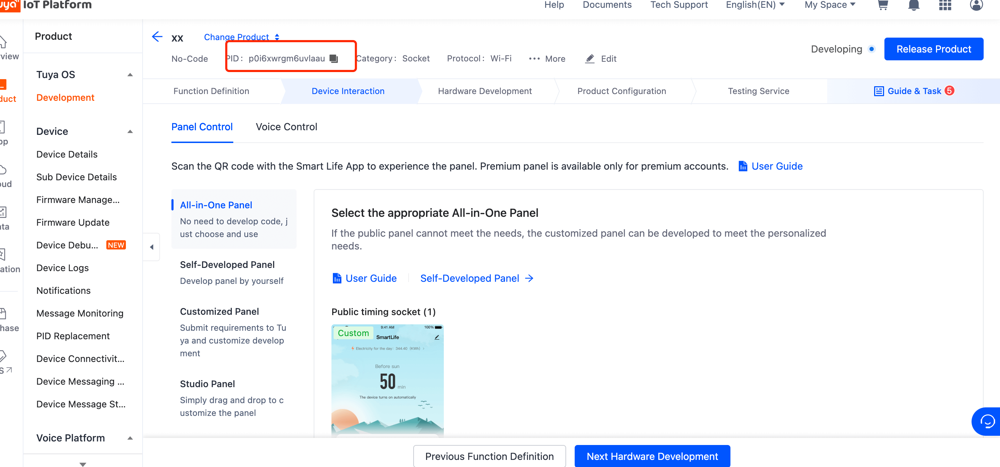
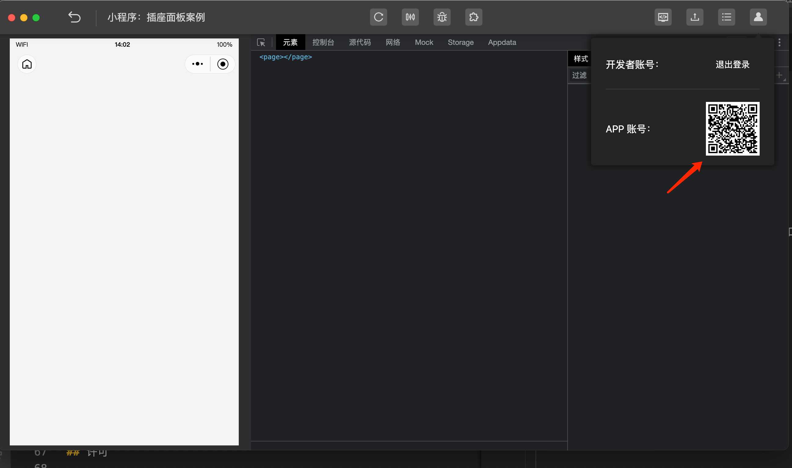
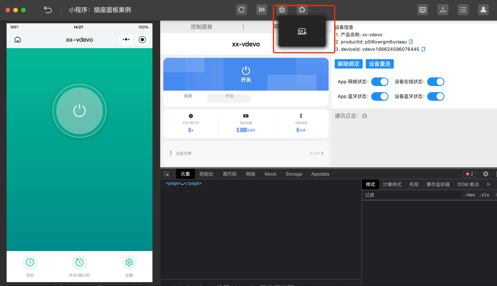
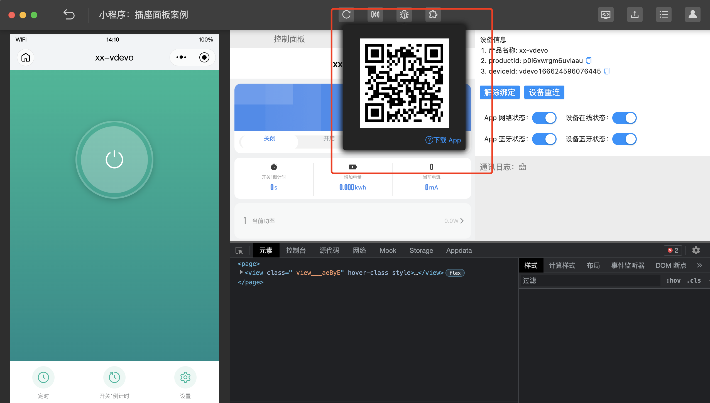

[English](README.md) | 简体中文[](README_zh.md)

## 插座面板案例

- 产品名称：插座面板

### 快速开始：

1. 前往[IoT 平台](https://iot.tuya.com/)创建产品

2. 选择品类 `插座`
   
3. 功能选择

   除了`常用功能`，选择以下`标准功能`
   

   ```
   cycle_time,
   random_time,
   child_lock
   ```

4. 确定并将你创建的产品`PID`记下并填写到项目中的 `project.tuya.json`
   

   ```
   {
     "projectname": "socket panel",
     "i18n": false,
     "description": "project description",
     "miniprogramRoot": "./dist/tuya",
     "dependencies": {
       "BaseKit": "3.0.0",
       "MiniKit": "3.0.2",
       "DeviceKit": "3.0.2",
       "BizKit": "3.0.1"
     },
     "baseversion": "2.10.1",
     "productId": "p0i6xwrgm6uvlaau"
   }
   ```

5. 安装项目并启动项目

   ```
   yarn && yarn start
   ```

6. 使用`智能小程序开发者工具`导入工程

   使用`涂鸦智能App`扫码登录
   

   打开`虚拟设备`进行调试
   

7. 扫码真机调试
   使用`涂鸦智能App`扫码真机调试
   
   <image src="./images/iot08.png" width=200 />

## 相关文档

更多信息，请访问以下链接

- [使用 `Ray` 开发万能面板](https://developer.tuya.com/cn/miniapp-codelabs/codelabs/panelmore-guide/index.html#0)
- [关于 Ray](https://developer.tuya.com/cn/ray)

## 如何获得技术支持

欢迎通过 [GitHub Issue](https://github.com/Tuya-Community/tuya-ray-demo/issues) 向我们反馈使用的问题和获得帮助

## 许可

[许可详情](LICENSE)
